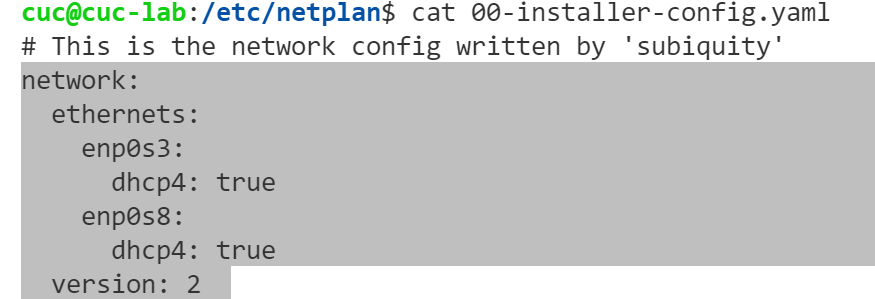
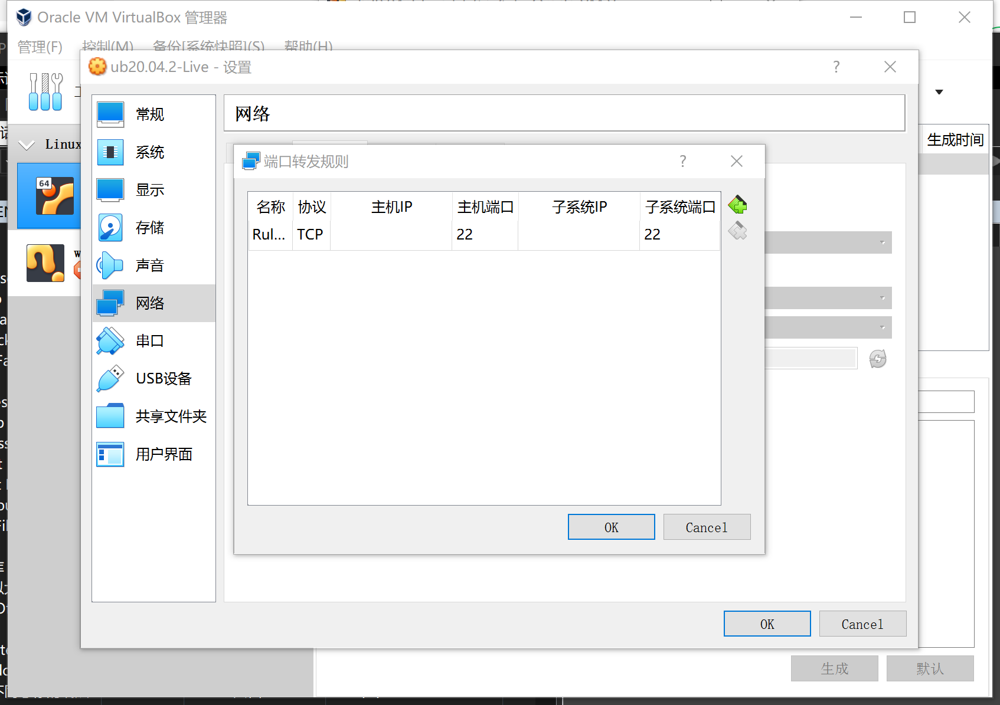
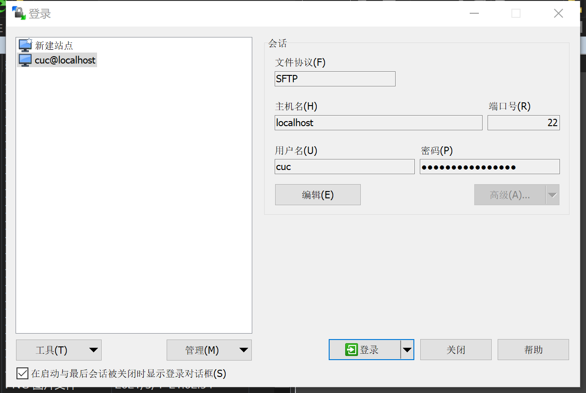
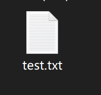
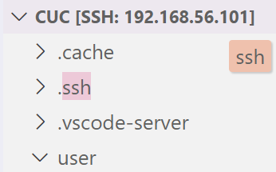
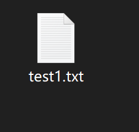

# 2022-linux-public-chen-xueting
2022-linux-public-chen-xueting created by GitHub Classroom

# Linux第一次实验作业

## Linux发行版本信息

### 查询代码

    rsb_release-a

### 代码内容

    No LSB modules are available.
    Distributor ID: Ubuntu
    Description:    Ubuntu 20.04.2 LTS
    Release:        20.04
    Codename:       focal

## Linux内核版本信息

### 查询代码

    uname -a

### 代码内容

    UTC 2021 x86_64 x86_64 x86_64 GNU/Linux

***

## 关于网卡自启动和ip的自动获取

通过下列代码查询有：
    
    ip a
    cd /etc/netplan
    ls
    cat 00-installer-config.yaml

    network:
    ethernets:
    enp0s3:
      dhcp4: true
    enp0s8:
      dhcp4: true   /*网课自启动的原因*/
    version: 2

***

## 虚拟机与宿主机文件互传

    step 1：下载scp

    step 2: 虚拟机的端口转发设置

    step 3： 进行WinSCP的操作设置

    step 3：登录后，界面实现

## 本机和远程Linux系统之间文件互传

    1.新建一个测试文档于指定目录（/d:）

    2.在服务器新建一个文件夹user用于测试

    
    3.从本地上传到服务器
    scp -r /d:/test.txt cuc@192.168.56.101:user

    4.从服务器加载文件到本地
    scp -r cuc@192.168.56.101:user/test1.txt /d:/
 

***

## ssh免密配置

### 代码

    ssh-keygen /* 配置公私钥对*/
    ssh-copy-id -i .ssh/id_rsa.pub cuc@192.168.56.101  /* 将秘钥写进远程操作端目录~/ .ssh/authorized_key.下*/
    ssh cuc@192.168.56.101 /*尝试免密登录*/

